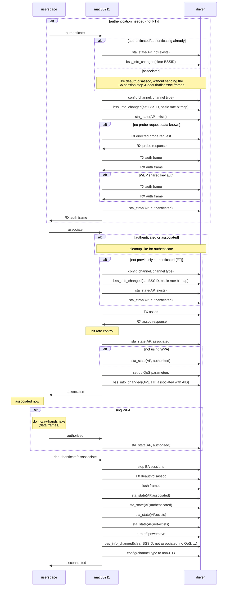

This outlines the Linux authentication/association and
deauthentication/disassociation flows.
This can be converted into a diagram using the service
at http://www.websequencediagrams.com/

```mermaid
sequenceDiagram
    participant userspace
    participant mac80211
    participant driver
    alt authentication needed (not FT)
    userspace->>mac80211: authenticate
    alt authenticated/authenticating already
    mac80211->>driver: sta_state(AP, not-exists)
    mac80211->>driver: bss_info_changed(clear BSSID)
    else associated
    Note over mac80211,driver: like deauth/disassoc, without sending the<br/>BA session stop & deauth/disassoc frames
    end
    mac80211->>driver: config(channel, channel type)
    mac80211->>driver: bss_info_changed(set BSSID, basic rate bitmap)
    mac80211->>driver: sta_state(AP, exists)
    alt no probe request data known
    mac80211->>driver: TX directed probe request
    driver->>mac80211: RX probe response
    end
    mac80211->>driver: TX auth frame
    driver->>mac80211: RX auth frame
    alt WEP shared key auth
    mac80211->>driver: TX auth frame
    driver->>mac80211: RX auth frame
    end
    mac80211->>driver: sta_state(AP, authenticated)
    mac80211->>userspace: RX auth frame
    end
    userspace->>mac80211: associate
    alt authenticated or associated
    Note over mac80211,driver: cleanup like for authenticate
    end
    alt not previously authenticated (FT)
    mac80211->>driver: config(channel, channel type)
    mac80211->>driver: bss_info_changed(set BSSID, basic rate bitmap)
    mac80211->>driver: sta_state(AP, exists)
    mac80211->>driver: sta_state(AP, authenticated)
    end
    mac80211->>driver: TX assoc
    driver->>mac80211: RX assoc response
    Note over mac80211: init rate control
    mac80211->>driver: sta_state(AP, associated)
    alt not using WPA
    mac80211->>driver: sta_state(AP, authorized)
    end
    mac80211->>driver: set up QoS parameters
    mac80211->>driver: bss_info_changed(QoS, HT, associated with AID)
    mac80211->>userspace: associated
    Note left of userspace: associated now
    alt using WPA
    Note over userspace: do 4-way-handshake<br/>(data frames)
    userspace->>mac80211: authorized
    mac80211->>driver: sta_state(AP, authorized)
    end
    userspace->>mac80211: deauthenticate/disassociate
    mac80211->>driver: stop BA sessions
    mac80211->>driver: TX deauth/disassoc
    mac80211->>driver: flush frames
    mac80211->>driver: sta_state(AP,associated)
    mac80211->>driver: sta_state(AP,authenticated)
    mac80211->>driver: sta_state(AP,exists)
    mac80211->>driver: sta_state(AP,not-exists)
    mac80211->>driver: turn off powersave
    mac80211->>driver: bss_info_changed(clear BSSID, not associated, no QoS, ...)
    mac80211->>driver: config(channel type to non-HT)
    mac80211->>userspace: disconnected
```
