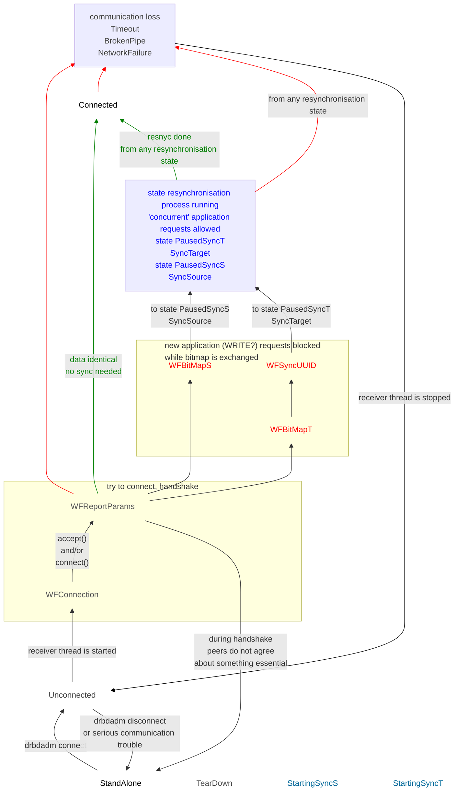

```mermaid
flowchart BT
  n0["StandAlone"]
  n1["Unconnected"]
  n2["communication loss<br/>Timeout<br/>BrokenPipe<br/>NetworkFailure"]
  n5["TearDown"]
  n6["Connected"]
  n7["StartingSyncS"]
  n8["StartingSyncT"]
  n12["state resynchronisation process running<br/>'concurrent' application requests allowed<br/>state PausedSyncT<br/>SyncTarget<br/>state PausedSyncS<br/>SyncSource"]
  subgraph g0["try to connect, handshake"]
    n3["WFConnection"]
    n4["WFReportParams"]
  end
  subgraph g1["new application (WRITE?) requests blocked<br/>while bitmap is exchanged"]
    n9["WFBitMapT"]
    n10["WFSyncUUID"]
    n11["WFBitMapS"]
  end
  n0 -->|"drbdadm connect"| n1
  n1 -->|"drbdadm disconnect<br/>or serious communication trouble"| n0
  n1 -->|"receiver thread is started"| n3
  n3 -->|"accept()<br/>and/or<br/>connect()"| n4
  n4 -->|"during handshake<br/>peers do not agree<br/>about something essential"| n0
  n4 -->|"data identical<br/>no sync needed"| n6
  n4 --> n11
  n4 --> n9
  n9 --> n10
  n11 -->|"to state PausedSyncS<br/>SyncSource"| n12
  n10 -->|"to state PausedSyncT<br/>SyncTarget"| n12
  n12 -->|"resnyc done<br/>from any resynchronisation state"| n6
  n4 --> n2
  n6 --> n2
  n12 -->|"from any resynchronisation state"| n2
  n2 -->|"receiver thread is stopped"| n1
  style n0 fill:gray,color:black,fill:transparent,stroke:transparent
  style n1 color:#444,fill:transparent,stroke:transparent
  style n2 color:#444
  style n3 color:#555,fill:transparent,stroke:transparent
  style n4 color:#555,fill:transparent,stroke:transparent
  style n5 color:#555,fill:transparent,stroke:transparent
  style n6 fill:green,color:black,fill:transparent,stroke:transparent
  style n7 color:#006c9c,fill:transparent,stroke:transparent
  style n8 color:#006c9c,fill:transparent,stroke:transparent
  style n9 color:red,fill:transparent,stroke:transparent
  style n10 color:red,fill:transparent,stroke:transparent
  style n11 color:red,fill:transparent,stroke:transparent
  style n12 color:blue
  linkStyle 5 stroke:green,color:green
  linkStyle 11 stroke:green,color:green
  linkStyle 12 stroke:red
  linkStyle 13 stroke:red
  linkStyle 14 stroke:red
  linkStyle 15 stroke:black
```
