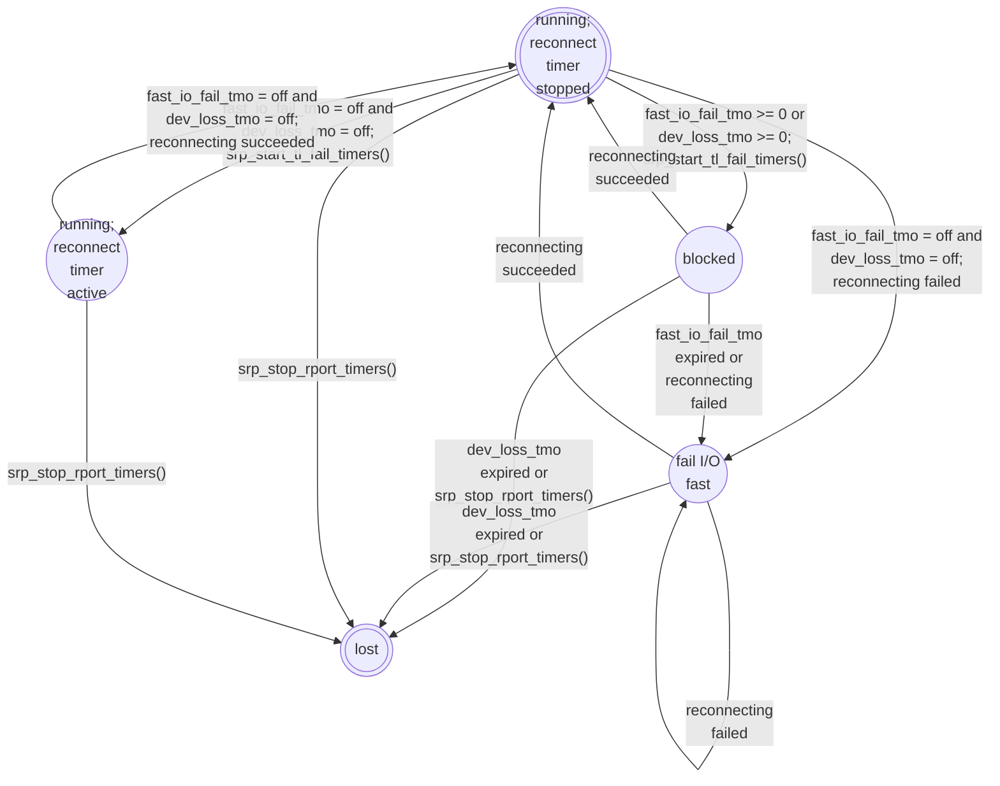

<!-- SPDX-License-Identifier: GPL-2.0 -->

```mermaid
flowchart TB
  n0((("running;<br/>reconnect<br/>timer<br/>stopped")))
  n1((("lost")))
  n2(("running;<br/>reconnect<br/>timer<br/>active"))
  n3(("blocked"))
  n4(("fail I/O<br/>fast"))
  n0 -->|"fast_io_fail_tmo = off and<br/>dev_loss_tmo = off;<br/>srp_start_tl_fail_timers()"| n2
  n2 -->|"fast_io_fail_tmo = off and<br/>dev_loss_tmo = off;<br/>reconnecting succeeded"| n0
  n0 -->|"fast_io_fail_tmo #62;= 0 or<br/>dev_loss_tmo #62;= 0;<br/>srp_start_tl_fail_timers()"| n3
  n0 -->|"fast_io_fail_tmo = off and<br/>dev_loss_tmo = off;<br/>reconnecting failed"| n4
  n3 -->|"fast_io_fail_tmo<br/>expired or<br/>reconnecting<br/>failed"| n4
  n3 -->|"dev_loss_tmo<br/>expired or<br/>srp_stop_rport_timers()"| n1
  n4 -->|"dev_loss_tmo<br/>expired or<br/>srp_stop_rport_timers()"| n1
  n3 -->|"reconnecting<br/>succeeded"| n0
  n4 -->|"reconnecting<br/>failed"| n4
  n4 -->|"reconnecting<br/>succeeded"| n0
  n0 -->|"srp_stop_rport_timers()"| n1
  n2 -->|"srp_stop_rport_timers()"| n1
```
